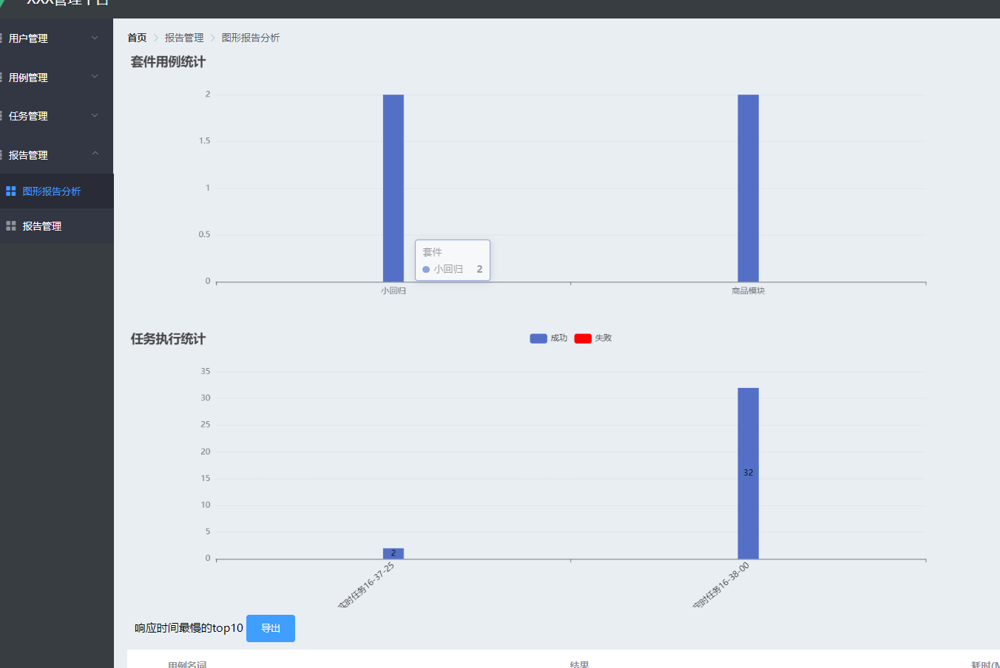
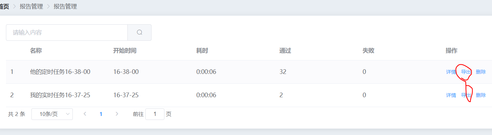
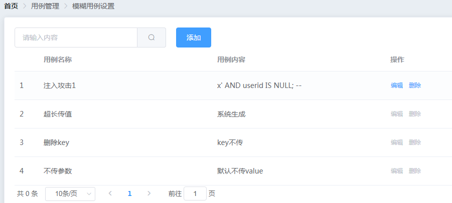
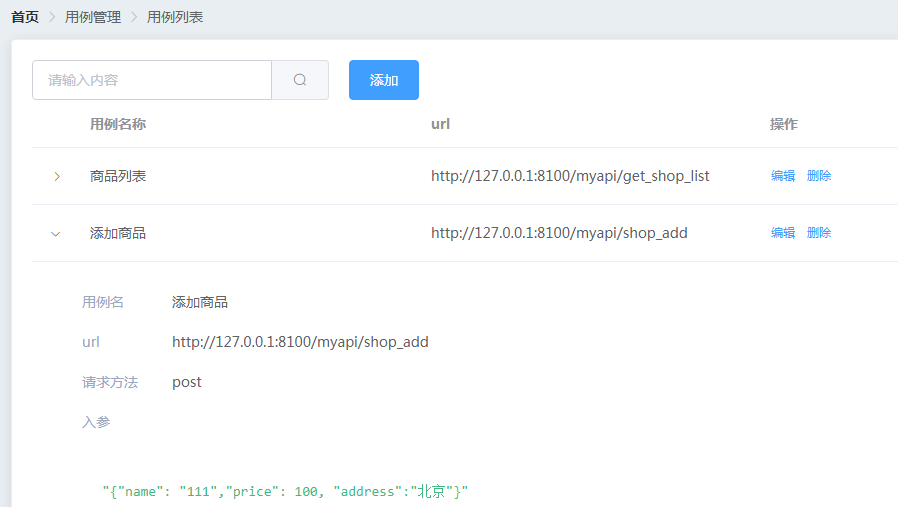
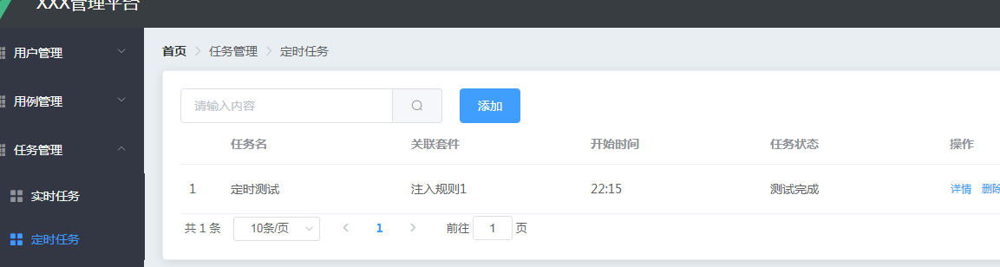
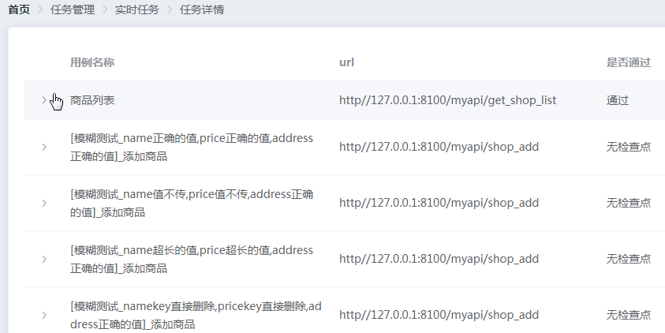
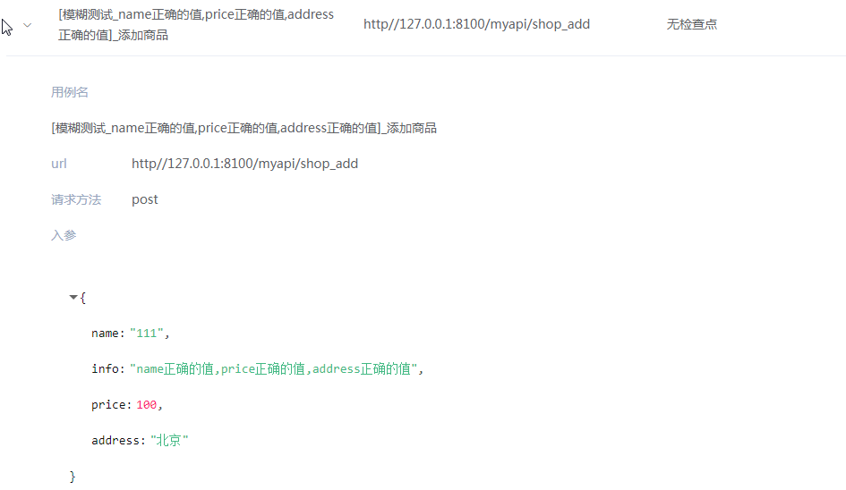

## 2023-5-4

- 新增在线查看服务器日志界面

## 2022-3-10

- 新增图形报告统计

- 新增导出excel功能

- 接口耗时统计

## 2021-1-31

- 新增模糊用例设置
- 用例展示页面修改为折叠表格
- 新增定时任务

## 2021-1-24
- 新增实时任务的模糊用例展示

## 2021-1-20
- 新增实时任务
- 查看实时任务执行情况

## 2021-1-09
- 实现用例增删改查
- 实现套件增删改查
- 修复登陆成功再次登陆bug

## 2020-12-14
- 实现用户管理增删改查

## 2020-11-29
- 采用的elementUI作为后台框架
- 实现登陆，退出登陆功能